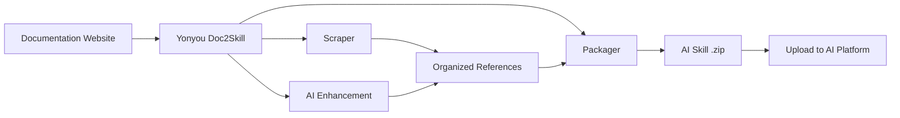

<p align="center">
  
</p>

# Yonyou Doc2Skill

English | [简体中文](README.zh-CN.md)

[](docs/README.md)
[](https://opensource.org/licenses/MIT)
[](https://www.python.org/downloads/)
[](https://modelcontextprotocol.io)
[](tests/)

**🧠 The data layer for AI systems.** Yonyou Doc2Skill turns documentation sites, GitHub repos, PDFs, videos, and other retained source types into structured knowledge assets—ready to power AI Skills (Claude, Gemini, OpenAI), RAG pipelines (LangChain, LlamaIndex, Pinecone), and AI coding assistants (Cursor, Windsurf, Cline) in minutes, not hours.

> 🌐 **[Browse the local docs](docs/README.md)** - Start with the packaged documentation set for Yonyou Doc2Skill.

> 📋 **Track delivery in your fork** - Replace repository board links with your Yonyou project tracker before publishing externally.

## 🌐 Ecosystem

Yonyou Doc2Skill is a multi-repo project. Here's where everything lives:

| Repository | Description | Links |
|-----------|-------------|-------|
| **yonyou-doc2skill** | Core CLI & MCP server (this repo) | `pip install yonyou-doc2skill` |
| **yonyou-doc2skill-docs** | Documentation and onboarding assets | [docs/README.md](docs/README.md) |
| **yonyou-doc2skill-configs** | Internal or curated preset/config repository | Publish from your Yonyou org |
| **yonyou-doc2skill-plugin** | Claude Code / MCP integration assets | Publish from your Yonyou org |
| **yonyou-doc2skill-action** | Optional CI/CD automation entrypoint | Publish from your Yonyou org |

> **Want to contribute?** The website and configs repos are great starting points for new contributors!

## 🧠 The Data Layer for AI Systems

**Yonyou Doc2Skill is the universal preprocessing layer** that sits between raw documentation and every AI system that consumes it. Whether you are building Claude skills, a LangChain RAG pipeline, or a Cursor `.cursorrules` file — the data preparation is identical. You do it once, and export to all targets.

```bash
# One command → structured knowledge asset
yonyou-doc2skill create https://docs.react.dev/
# or: yonyou-doc2skill create facebook/react
# or: yonyou-doc2skill create ./my-project

# Export to any AI system
yonyou-doc2skill package output/react --target claude      # → Claude AI Skill (ZIP)
yonyou-doc2skill package output/react --target langchain   # → LangChain Documents
yonyou-doc2skill package output/react --target llama-index # → LlamaIndex TextNodes
yonyou-doc2skill package output/react --target cursor      # → .cursorrules
```

### What gets built

| Output | Target | What it powers |
|--------|--------|---------------|
| **Claude Skill** (ZIP + YAML) | `--target claude` | Claude Code, Claude API |
| **Gemini Skill** (tar.gz) | `--target gemini` | Google Gemini |
| **OpenAI / Custom GPT** (ZIP) | `--target openai` | GPT-4o, custom assistants |
| **LangChain Documents** | `--target langchain` | QA chains, agents, retrievers |
| **LlamaIndex TextNodes** | `--target llama-index` | Query engines, chat engines |
| **Haystack Documents** | `--target haystack` | Enterprise RAG pipelines |
| **Pinecone-ready** (Markdown) | `--target markdown` | Vector upsert |
| **ChromaDB / FAISS / Qdrant** | `--format chroma/faiss/qdrant` | Local vector DBs |
| **Cursor** `.cursorrules` | `--target claude` → copy | Cursor IDE AI context |
| **Windsurf / Cline / Continue** | `--target claude` → copy | VS Code, IntelliJ, Vim |

### Why it matters

- ⚡ **99% faster** — Days of manual data prep → 15–45 minutes
- 🎯 **AI Skill quality** — 500+ line SKILL.md files with examples, patterns, and guides
- 📊 **RAG-ready chunks** — Smart chunking preserves code blocks and maintains context
- 🎬 **Videos** — Extract code, transcripts, and structured knowledge from YouTube and local videos
- 🔄 **Multi-source** — Combine the retained source types (docs, GitHub, PDFs, videos, local files, wikis, and more) into one knowledge asset
- 🌐 **One prep, every target** — Export the same asset to 16 platforms without re-scraping
- ✅ **Battle-tested** — 2,540+ tests, 24+ framework presets, production-ready

## 🚀 Quick Start (3 Commands)

```bash
# 1. Install
pip install yonyou-doc2skill

# 2. Create skill from any source
yonyou-doc2skill create https://docs.django.com/

# 3. Package for your AI platform
yonyou-doc2skill package output/django --target claude
```

**That's it!** You now have `output/django-claude.zip` ready to use.

## Official Skill

If you want end users to generate their own skills through an agent, deliver these two pieces together:

- the local CLI package: `yonyou-doc2skill`
- the official wrapper skill: `skills/yonyou-doc2skill/`

The delivery model is:

1. users install `yonyou-doc2skill` locally
2. users install the official skill from `skills/yonyou-doc2skill/`
3. the official skill calls local `yonyou-doc2skill create ...`
4. if needed, the official skill follows with `yonyou-doc2skill package ...`

```bash
# Use a different AI agent for enhancement (default: claude)
yonyou-doc2skill create https://docs.django.com/ --agent kimi
yonyou-doc2skill create https://docs.django.com/ --agent codex
yonyou-doc2skill create https://docs.django.com/ --agent-cmd "my-custom-agent run"
```

### Supported Sources (11 Retained)

```bash
# GitHub repository
yonyou-doc2skill create facebook/react

# Local project
yonyou-doc2skill create ./my-project

# PDF document
yonyou-doc2skill create manual.pdf

# Word document
yonyou-doc2skill create report.docx

# PowerPoint presentation
yonyou-doc2skill create presentation.pptx

# AsciiDoc document
yonyou-doc2skill create guide.adoc

# Local HTML file
yonyou-doc2skill create page.html

# Video (YouTube, Vimeo, or local file — requires yonyou-doc2skill[video])
yonyou-doc2skill video --url https://www.youtube.com/watch?v=... --name mytutorial
# First time? Auto-install GPU-aware visual deps:
yonyou-doc2skill video --setup

# Confluence wiki
yonyou-doc2skill confluence --space TEAM --name wiki

# Slack/Discord chat export
yonyou-doc2skill chat --export-dir ./slack-export --name team-chat
```

### Export Everywhere

```bash
# Package for multiple platforms
for platform in claude gemini openai langchain; do
  yonyou-doc2skill package output/django --target $platform
done
```

## What is Yonyou Doc2Skill?

Yonyou Doc2Skill is the **data layer for AI systems**. It transforms the retained source types—documentation websites, GitHub repositories, PDFs, videos, Word documents, local codebases, local HTML files, AsciiDoc documents, PowerPoint presentations, Confluence wikis, and Slack/Discord exports—into structured knowledge assets for every AI target:

| Use Case | What you get | Examples |
|----------|-------------|---------|
| **AI Skills** | Comprehensive SKILL.md + references | Claude Code, Gemini, GPT |
| **RAG Pipelines** | Chunked documents with rich metadata | LangChain, LlamaIndex, Haystack |
| **Vector Databases** | Pre-formatted data ready for upsert | Pinecone, Chroma, Weaviate, FAISS |
| **AI Coding Assistants** | Context files your IDE AI reads automatically | Cursor, Windsurf, Cline, Continue.dev |

## 📚 Documentation

| I want to... | Read this |
|--------------|-----------|
| **Get started quickly** | [Quick Start](docs/getting-started/02-quick-start.md) - 3 commands to first skill |
| **Understand concepts** | [Core Concepts](docs/user-guide/01-core-concepts.md) - How it works |
| **Scrape sources** | [Scraping Guide](docs/user-guide/02-scraping.md) - All source types |
| **Enhance skills** | [Enhancement Guide](docs/user-guide/03-enhancement.md) - AI enhancement |
| **Export skills** | [Packaging Guide](docs/user-guide/04-packaging.md) - Platform export |
| **Look up commands** | [CLI Reference](docs/reference/CLI_REFERENCE.md) - All 20 commands |
| **Configure** | [Config Format](docs/reference/CONFIG_FORMAT.md) - JSON specification |
| **Fix issues** | [Troubleshooting](docs/user-guide/06-troubleshooting.md) - Common problems |

**Complete documentation:** [docs/README.md](docs/README.md)

Instead of spending days on manual preprocessing, Yonyou Doc2Skill:

1. **Ingests** — docs, GitHub repos, local codebases, PDFs, videos, wikis, chat exports, and other retained source types
2. **Analyzes** — deep AST parsing, pattern detection, API extraction
3. **Structures** — categorized reference files with metadata
4. **Enhances** — AI-powered SKILL.md generation (Claude, Gemini, or local)
5. **Exports** — 16 platform-specific formats from one asset

## Why Use This?

### For AI Skill Builders (Claude, Gemini, OpenAI)

- 🎯 **Production-grade Skills** — 500+ line SKILL.md files with code examples, patterns, and guides
- 🔄 **Enhancement Workflows** — Apply `security-focus`, `architecture-comprehensive`, or custom YAML presets
- 🎮 **Any Domain** — Game engines (Godot, Unity), frameworks (React, Django), internal tools
- 🔧 **Teams** — Combine internal docs + code into a single source of truth
- 📚 **Quality** — AI-enhanced with examples, quick reference, and navigation guidance

### For RAG Builders & AI Engineers

- 🤖 **RAG-ready data** — Pre-chunked LangChain `Documents`, LlamaIndex `TextNodes`, Haystack `Documents`
- 🚀 **99% faster** — Days of preprocessing → 15–45 minutes
- 📊 **Smart metadata** — Categories, sources, types → better retrieval accuracy
- 🔄 **Multi-source** — Combine docs + GitHub + PDFs + videos in one pipeline
- 🌐 **Platform-agnostic** — Export to any vector DB or framework without re-scraping

### For AI Coding Assistant Users

- 💻 **Cursor / Windsurf / Cline** — Generate `.cursorrules` / `.windsurfrules` / `.clinerules` automatically
- 🎯 **Persistent context** — AI "knows" your frameworks without repeated prompting
- 📚 **Always current** — Update context in minutes when docs change

## Key Features

### 🌐 Documentation Scraping
- ✅ **Smart SPA Discovery** - Three-layer discovery for JavaScript SPA sites (sitemap.xml → llms.txt → headless browser rendering)
- ✅ **llms.txt Support** - Automatically detects and uses LLM-ready documentation files (10x faster)
- ✅ **Universal Scraper** - Works with ANY documentation website
- ✅ **Smart Categorization** - Automatically organizes content by topic
- ✅ **Code Language Detection** - Recognizes Python, JavaScript, C++, GDScript, etc.
- ✅ **24+ Ready-to-Use Presets** - Godot, React, Vue, Django, FastAPI, and more

### 📄 PDF Support
- ✅ **Basic PDF Extraction** - Extract text, code, and images from PDF files
- ✅ **OCR for Scanned PDFs** - Extract text from scanned documents
- ✅ **Password-Protected PDFs** - Handle encrypted PDFs
- ✅ **Table Extraction** - Extract complex tables from PDFs
- ✅ **Parallel Processing** - 3x faster for large PDFs
- ✅ **Intelligent Caching** - 50% faster on re-runs

### 🎬 Video Extraction
- ✅ **YouTube & Local Videos** - Extract transcripts, on-screen code, and structured knowledge from videos
- ✅ **Visual Frame Analysis** - OCR extraction from code editors, terminals, slides, and diagrams
- ✅ **GPU Auto-Detection** - Automatically installs correct PyTorch build (CUDA/ROCm/MPS/CPU)
- ✅ **AI Enhancement** - Two-pass: clean OCR artifacts + generate polished SKILL.md
- ✅ **Time Clipping** - Extract specific sections with `--start-time` and `--end-time`
- ✅ **Playlist Support** - Batch process all videos in a YouTube playlist
- ✅ **Vision API Fallback** - Use Claude Vision for low-confidence OCR frames

### 🐙 GitHub Repository Analysis
- ✅ **Deep Code Analysis** - AST parsing for Python, JavaScript, TypeScript, Java, C++, Go
- ✅ **API Extraction** - Functions, classes, methods with parameters and types
- ✅ **Repository Metadata** - README, file tree, language breakdown, stars/forks
- ✅ **GitHub Issues & PRs** - Fetch open/closed issues with labels and milestones
- ✅ **CHANGELOG & Releases** - Automatically extract version history
- ✅ **Conflict Detection** - Compare documented APIs vs actual code implementation
- ✅ **MCP Integration** - Natural language: "Scrape GitHub repo facebook/react"

### 🔄 Unified Multi-Source Scraping
- ✅ **Combine Multiple Sources** - Mix documentation + GitHub + PDF in one skill
- ✅ **Conflict Detection** - Automatically finds discrepancies between docs and code
- ✅ **Intelligent Merging** - Rule-based or AI-powered conflict resolution
- ✅ **Transparent Reporting** - Side-by-side comparison with ⚠️ warnings
- ✅ **Documentation Gap Analysis** - Identifies outdated docs and undocumented features
- ✅ **Single Source of Truth** - One skill showing both intent (docs) and reality (code)
- ✅ **Backward Compatible** - Legacy single-source configs still work

### 🤖 Multi-LLM Platform Support
- ✅ **12 LLM Platforms** - Claude AI, Google Gemini, OpenAI ChatGPT, MiniMax AI, Generic Markdown, OpenCode, Kimi (Moonshot AI), DeepSeek AI, Qwen (Alibaba), OpenRouter, Together AI, Fireworks AI
- ✅ **Universal Scraping** - Same documentation works for all platforms
- ✅ **Platform-Specific Packaging** - Optimized formats for each LLM
- ✅ **One-Command Export** - `--target` flag selects platform
- ✅ **Optional Dependencies** - Install only what you need
- ✅ **100% Backward Compatible** - Existing Claude workflows unchanged

| Platform | Format | Upload | Enhancement | API Key | Custom Endpoint |
|----------|--------|--------|-------------|---------|-----------------|
| **Claude AI** | ZIP + YAML | ✅ Auto | ✅ Yes | ANTHROPIC_API_KEY | ANTHROPIC_BASE_URL |
| **Google Gemini** | tar.gz | ✅ Auto | ✅ Yes | GOOGLE_API_KEY | - |
| **OpenAI ChatGPT** | ZIP + Vector Store | ✅ Auto | ✅ Yes | OPENAI_API_KEY | - |
| **MiniMax AI** | ZIP + Knowledge Files | ✅ Auto | ✅ Yes | MINIMAX_API_KEY | - |
| **Generic Markdown** | ZIP | ❌ Manual | ❌ No | - | - |

```bash
# Claude (default - no changes needed!)
yonyou-doc2skill package output/react/
yonyou-doc2skill upload react.zip

# Google Gemini
pip install yonyou-doc2skill[gemini]
yonyou-doc2skill package output/react/ --target gemini
yonyou-doc2skill upload react-gemini.tar.gz --target gemini

# OpenAI ChatGPT
pip install yonyou-doc2skill[openai]
yonyou-doc2skill package output/react/ --target openai
yonyou-doc2skill upload react-openai.zip --target openai

# MiniMax AI
pip install yonyou-doc2skill[minimax]
yonyou-doc2skill package output/react/ --target minimax
yonyou-doc2skill upload react-minimax.zip --target minimax

# Generic Markdown (universal export)
yonyou-doc2skill package output/react/ --target markdown
# Use the markdown files directly in any LLM
```

<details>
<summary>🔧 <strong>Environment Variables for Claude-Compatible APIs (e.g., GLM-4.7)</strong></summary>

Yonyou Doc2Skill supports any Claude-compatible API endpoint:

```bash
# Option 1: Official Anthropic API (default)
export ANTHROPIC_API_KEY=sk-ant-...

# Option 2: GLM-4.7 Claude-compatible API
export ANTHROPIC_API_KEY=your-glm-47-api-key
export ANTHROPIC_BASE_URL=https://glm-4-7-endpoint.com/v1

# All AI enhancement features will use the configured endpoint
yonyou-doc2skill enhance output/react/
yonyou-doc2skill analyze --directory . --enhance
```

**Note**: Setting `ANTHROPIC_BASE_URL` allows you to use any Claude-compatible API endpoint, such as GLM-4.7 (智谱 AI) or other compatible services.

</details>

**Installation:**
```bash
# Install with Gemini support
pip install yonyou-doc2skill[gemini]

# Install with OpenAI support
pip install yonyou-doc2skill[openai]

# Install with MiniMax support
pip install yonyou-doc2skill[minimax]

# Install with all LLM platforms
pip install yonyou-doc2skill[all-llms]
```

### 🔗 RAG Framework Integrations

- ✅ **LangChain Documents** - Direct export to `Document` format with `page_content` + metadata
  - Perfect for: QA chains, retrievers, vector stores, agents
  - Example: [LangChain RAG Pipeline](examples/langchain-rag-pipeline/)
  - Guide: [LangChain Integration](docs/integrations/LANGCHAIN.md)

- ✅ **LlamaIndex TextNodes** - Export to `TextNode` format with unique IDs + embeddings
  - Perfect for: Query engines, chat engines, storage context
  - Example: [LlamaIndex Query Engine](examples/llama-index-query-engine/)
  - Guide: [LlamaIndex Integration](docs/integrations/LLAMA_INDEX.md)

- ✅ **Pinecone-Ready Format** - Optimized for vector database upsert
  - Perfect for: Production vector search, semantic search, hybrid search
  - Example: [Pinecone Upsert](examples/pinecone-upsert/)
  - Guide: [Pinecone Integration](docs/integrations/PINECONE.md)

**Quick Export:**
```bash
# LangChain Documents (JSON)
yonyou-doc2skill package output/django --target langchain
# → output/django-langchain.json

# LlamaIndex TextNodes (JSON)
yonyou-doc2skill package output/django --target llama-index
# → output/django-llama-index.json

# Markdown (Universal)
yonyou-doc2skill package output/django --target markdown
# → output/django-markdown/SKILL.md + references/
```

**Complete RAG Pipeline Guide:** [RAG Pipelines Documentation](docs/integrations/RAG_PIPELINES.md)

---

### 🧠 AI Coding Assistant Integrations

Transform any framework documentation into expert coding context for 4+ AI assistants:

- ✅ **Cursor IDE** - Generate `.cursorrules` for AI-powered code suggestions
  - Perfect for: Framework-specific code generation, consistent patterns
  - Works with: Cursor IDE (VS Code fork)
  - Guide: [Cursor Integration](docs/integrations/CURSOR.md)
  - Example: [Cursor React Skill](examples/cursor-react-skill/)

- ✅ **Windsurf** - Customize Windsurf's AI assistant context with `.windsurfrules`
  - Perfect for: IDE-native AI assistance, flow-based coding
  - Works with: Windsurf IDE by Codeium
  - Guide: [Windsurf Integration](docs/integrations/WINDSURF.md)
  - Example: [Windsurf FastAPI Context](examples/windsurf-fastapi-context/)

- ✅ **Cline (VS Code)** - System prompts + MCP for VS Code agent
  - Perfect for: Agentic code generation in VS Code
  - Works with: Cline extension for VS Code
  - Guide: [Cline Integration](docs/integrations/CLINE.md)
  - Example: [Cline Django Assistant](examples/cline-django-assistant/)

- ✅ **Continue.dev** - Context servers for IDE-agnostic AI
  - Perfect for: Multi-IDE environments (VS Code, JetBrains, Vim), custom LLM providers
  - Works with: Any IDE with Continue.dev plugin
  - Guide: [Continue Integration](docs/integrations/CONTINUE_DEV.md)
  - Example: [Continue Universal Context](examples/continue-dev-universal/)

**Quick Export for AI Coding Tools:**
```bash
# For any AI coding assistant (Cursor, Windsurf, Cline, Continue.dev)
yonyou-doc2skill scrape --config configs/django.json
yonyou-doc2skill package output/django --target claude  # or --target markdown

# Copy to your project (example for Cursor)
cp output/django-claude/SKILL.md my-project/.cursorrules

# Or for Windsurf
cp output/django-claude/SKILL.md my-project/.windsurf/rules/django.md

# Or for Cline
cp output/django-claude/SKILL.md my-project/.clinerules

# Or for Continue.dev (HTTP server)
python examples/continue-dev-universal/context_server.py
# Configure in ~/.continue/config.json
```

**Integration Hub:** [All AI System Integrations](docs/integrations/INTEGRATIONS.md)

---

### 🌊 Three-Stream GitHub Architecture
- ✅ **Triple-Stream Analysis** - Split GitHub repos into Code, Docs, and Insights streams
- ✅ **Unified Codebase Analyzer** - Works with GitHub URLs AND local paths
- ✅ **C3.x as Analysis Depth** - Choose 'basic' (1-2 min) or 'c3x' (20-60 min) analysis
- ✅ **Enhanced Router Generation** - GitHub metadata, README quick start, common issues
- ✅ **Issue Integration** - Top problems and solutions from GitHub issues
- ✅ **Smart Routing Keywords** - GitHub labels weighted 2x for better topic detection

**Three Streams Explained:**
- **Stream 1: Code** - Deep C3.x analysis (patterns, examples, guides, configs, architecture)
- **Stream 2: Docs** - Repository documentation (README, CONTRIBUTING, docs/*.md)
- **Stream 3: Insights** - Community knowledge (issues, labels, stars, forks)

```python
from yonyou_doc2skill.cli.unified_codebase_analyzer import UnifiedCodebaseAnalyzer

# Analyze GitHub repo with all three streams
analyzer = UnifiedCodebaseAnalyzer()
result = analyzer.analyze(
    source="https://github.com/facebook/react",
    depth="c3x",  # or "basic" for fast analysis
    fetch_github_metadata=True
)

# Access code stream (C3.x analysis)
print(f"Design patterns: {len(result.code_analysis['c3_1_patterns'])}")
print(f"Test examples: {result.code_analysis['c3_2_examples_count']}")

# Access docs stream (repository docs)
print(f"README: {result.github_docs['readme'][:100]}")

# Access insights stream (GitHub metadata)
print(f"Stars: {result.github_insights['metadata']['stars']}")
print(f"Common issues: {len(result.github_insights['common_problems'])}")
```

**See complete documentation**: [Three-Stream Implementation Summary](docs/IMPLEMENTATION_SUMMARY_THREE_STREAM.md)

### 🔐 Smart Rate Limit Management & Configuration
- ✅ **Multi-Token Configuration System** - Manage multiple GitHub accounts (personal, work, OSS)
  - Secure config storage at `~/.config/yonyou-doc2skill/config.json` (600 permissions)
  - Per-profile rate limit strategies: `prompt`, `wait`, `switch`, `fail`
  - Configurable timeout per profile (default: 30 min, prevents indefinite waits)
  - Smart fallback chain: CLI arg → Env var → Config file → Prompt
  - API key management for Claude, Gemini, OpenAI
- ✅ **Interactive Configuration Wizard** - Beautiful terminal UI for easy setup
  - Browser integration for token creation (auto-opens GitHub, etc.)
  - Token validation and connection testing
  - Visual status display with color coding
- ✅ **Intelligent Rate Limit Handler** - No more indefinite waits!
  - Upfront warning about rate limits (60/hour vs 5000/hour)
  - Real-time detection from GitHub API responses
  - Live countdown timers with progress
  - Automatic profile switching when rate limited
  - Four strategies: prompt (ask), wait (countdown), switch (try another), fail (abort)
- ✅ **Resume Capability** - Continue interrupted jobs
  - Auto-save progress at configurable intervals (default: 60 sec)
  - List all resumable jobs with progress details
  - Auto-cleanup of old jobs (default: 7 days)
- ✅ **CI/CD Support** - Non-interactive mode for automation
  - `--non-interactive` flag fails fast without prompts
  - `--profile` flag to select specific GitHub account
  - Clear error messages for pipeline logs

**Quick Setup:**
```bash
# One-time configuration (5 minutes)
yonyou-doc2skill config --github

# Use specific profile for private repos
yonyou-doc2skill github --repo mycompany/private-repo --profile work

# CI/CD mode (fail fast, no prompts)
yonyou-doc2skill github --repo owner/repo --non-interactive

# Resume interrupted job
yonyou-doc2skill resume --list
yonyou-doc2skill resume github_react_20260117_143022
```

**Rate Limit Strategies Explained:**
- **prompt** (default) - Ask what to do when rate limited (wait, switch, setup token, cancel)
- **wait** - Automatically wait with countdown timer (respects timeout)
- **switch** - Automatically try next available profile (for multi-account setups)
- **fail** - Fail immediately with clear error (perfect for CI/CD)

### 🎯 Bootstrap Skill - Self-Hosting

Generate yonyou-doc2skill as a skill to use within your AI agent (Claude Code, Kimi, Codex, etc.):

```bash
# Generate the skill
./scripts/bootstrap_skill.sh

# Install to Claude Code
cp -r output/yonyou-doc2skill ~/.claude/skills/
```

**What you get:**
- ✅ **Complete skill documentation** - All CLI commands and usage patterns
- ✅ **CLI command reference** - Every tool and its options documented
- ✅ **Quick start examples** - Common workflows and best practices
- ✅ **Auto-generated API docs** - Code analysis, patterns, and examples

### 🔐 Private Config Repositories
- ✅ **Git-Based Config Sources** - Fetch configs from private/team git repositories
- ✅ **Multi-Source Management** - Register unlimited GitHub, GitLab, Bitbucket repos
- ✅ **Team Collaboration** - Share custom configs across 3-5 person teams
- ✅ **Enterprise Support** - Scale to 500+ developers with priority-based resolution
- ✅ **Secure Authentication** - Environment variable tokens (GITHUB_TOKEN, GITLAB_TOKEN)
- ✅ **Intelligent Caching** - Clone once, pull updates automatically
- ✅ **Offline Mode** - Work with cached configs when offline

### 🤖 Codebase Analysis (C3.x)

**C3.4: Configuration Pattern Extraction with AI Enhancement**
- ✅ **9 Config Formats** - JSON, YAML, TOML, ENV, INI, Python, JavaScript, Dockerfile, Docker Compose
- ✅ **7 Pattern Types** - Database, API, logging, cache, email, auth, server configurations
- ✅ **AI Enhancement** - Optional dual-mode AI analysis (API + LOCAL)
  - Explains what each config does
  - Suggests best practices and improvements
  - **Security analysis** - Finds hardcoded secrets, exposed credentials
- ✅ **Auto-Documentation** - Generates JSON + Markdown documentation of all configs
- ✅ **MCP Integration** - `extract_config_patterns` tool with enhancement support

**C3.3: AI-Enhanced How-To Guides**
- ✅ **Comprehensive AI Enhancement** - Transforms basic guides into professional tutorials
- ✅ **5 Automatic Improvements** - Step descriptions, troubleshooting, prerequisites, next steps, use cases
- ✅ **Dual-Mode Support** - API mode (Claude API) or LOCAL mode (Claude Code CLI)
- ✅ **No API Costs with LOCAL Mode** - FREE enhancement using your Claude Code Max plan
- ✅ **Quality Transformation** - 75-line templates → 500+ line comprehensive guides

**Usage:**
```bash
# Quick analysis (1-2 min, basic features only)
yonyou-doc2skill analyze --directory tests/ --quick

# Comprehensive analysis with AI (20-60 min, all features)
yonyou-doc2skill analyze --directory tests/ --comprehensive

# With AI enhancement
yonyou-doc2skill analyze --directory tests/ --enhance
```

**Full Documentation:** [docs/HOW_TO_GUIDES.md](docs/HOW_TO_GUIDES.md#ai-enhancement-new)

### 🔄 Enhancement Workflow Presets

Reusable YAML-defined enhancement pipelines that control how AI transforms your raw documentation into a polished skill.

- ✅ **5 Bundled Presets** — `default`, `minimal`, `security-focus`, `architecture-comprehensive`, `api-documentation`
- ✅ **User-Defined Presets** — add custom workflows to `~/.config/yonyou-doc2skill/workflows/`
- ✅ **Multiple Workflows** — chain two or more workflows in one command
- ✅ **Fully Managed CLI** — list, inspect, copy, add, remove, and validate workflows

```bash
# Apply a single workflow
yonyou-doc2skill create ./my-project --enhance-workflow security-focus

# Chain multiple workflows (applied in order)
yonyou-doc2skill create ./my-project \
  --enhance-workflow security-focus \
  --enhance-workflow minimal

# Manage presets
yonyou-doc2skill workflows list                          # List all (bundled + user)
yonyou-doc2skill workflows show security-focus           # Print YAML content
yonyou-doc2skill workflows copy security-focus           # Copy to user dir for editing
yonyou-doc2skill workflows add ./my-workflow.yaml        # Install a custom preset
yonyou-doc2skill workflows remove my-workflow            # Remove a user preset
yonyou-doc2skill workflows validate security-focus       # Validate preset structure

# Copy multiple at once
yonyou-doc2skill workflows copy security-focus minimal api-documentation

# Add multiple files at once
yonyou-doc2skill workflows add ./wf-a.yaml ./wf-b.yaml

# Remove multiple at once
yonyou-doc2skill workflows remove my-wf-a my-wf-b
```

**YAML preset format:**
```yaml
name: security-focus
description: "Security-focused review: vulnerabilities, auth, data handling"
version: "1.0"
stages:
  - name: vulnerabilities
    type: custom
    prompt: "Review for OWASP top 10 and common security vulnerabilities..."
  - name: auth-review
    type: custom
    prompt: "Examine authentication and authorisation patterns..."
    uses_history: true
```

### ⚡ Performance & Scale
- ✅ **Async Mode** - 2-3x faster scraping with async/await (use `--async` flag)
- ✅ **Large Documentation Support** - Handle 10K-40K+ page docs with intelligent splitting
- ✅ **Router/Hub Skills** - Intelligent routing to specialized sub-skills
- ✅ **Parallel Scraping** - Process multiple skills simultaneously
- ✅ **Checkpoint/Resume** - Never lose progress on long scrapes
- ✅ **Caching System** - Scrape once, rebuild instantly

### 🤖 Agent-Agnostic Skill Generation
- ✅ **Multi-Agent Support** - Generate skills for Claude, Kimi, Codex, Copilot, OpenCode, or any custom agent via `--agent` flag
- ✅ **Custom Agent Commands** - Use `--agent-cmd` to specify a custom agent CLI command for enhancement
- ✅ **Universal Flags** - `--agent` and `--agent-cmd` available on all commands (create, scrape, github, pdf, etc.)

### 📦 Marketplace Pipeline
- ✅ **Publish to Marketplace** - Publish skills to Claude Code plugin marketplace repos
- ✅ **End-to-End Pipeline** - From documentation source to published marketplace entry

### ✅ Quality Assurance
- ✅ **Fully Tested** - 2,540+ tests with comprehensive coverage

---

## 📦 Installation

```bash
# Basic install (documentation scraping, GitHub analysis, PDF, packaging)
pip install yonyou-doc2skill

# With all LLM platform support
pip install yonyou-doc2skill[all-llms]

# With MCP server
pip install yonyou-doc2skill[mcp]

# Everything
pip install yonyou-doc2skill[all]
```

**Need help choosing?** Run the setup wizard:
```bash
yonyou-doc2skill-setup
```

### Installation Options

| Install | Features |
|---------|----------|
| `pip install yonyou-doc2skill` | Scraping, GitHub analysis, PDF, all platforms |
| `pip install yonyou-doc2skill[gemini]` | + Google Gemini support |
| `pip install yonyou-doc2skill[openai]` | + OpenAI ChatGPT support |
| `pip install yonyou-doc2skill[all-llms]` | + All LLM platforms |
| `pip install yonyou-doc2skill[mcp]` | + MCP server for Claude Code, Cursor, etc. |
| `pip install yonyou-doc2skill[video]` | + YouTube/Vimeo transcript & metadata extraction |
| `pip install yonyou-doc2skill[video-full]` | + Whisper transcription & visual frame extraction |
| `pip install yonyou-doc2skill[pptx]` | + PowerPoint support |
| `pip install yonyou-doc2skill[confluence]` | + Confluence wiki support |
| `pip install yonyou-doc2skill[chat]` | + Slack/Discord chat export support |
| `pip install yonyou-doc2skill[asciidoc]` | + AsciiDoc document support |
| `pip install yonyou-doc2skill[all]` | Everything enabled |

> **Video visual deps (GPU-aware):** After installing `yonyou-doc2skill[video-full]`, run
> `yonyou-doc2skill video --setup` to auto-detect your GPU and install the correct PyTorch
> variant + easyocr. This is the recommended way to install visual extraction dependencies.

---

## 🚀 One-Command Install Workflow

**The fastest way to go from config to uploaded skill - complete automation:**

```bash
# Install React skill from official configs (auto-uploads to Claude)
yonyou-doc2skill install --config react

# Install from local config file
yonyou-doc2skill install --config configs/custom.json

# Install without uploading (package only)
yonyou-doc2skill install --config django --no-upload

# Preview workflow without executing
yonyou-doc2skill install --config react --dry-run
```

**Time:** 20-45 minutes total | **Quality:** Production-ready (9/10) | **Cost:** Free

**Phases executed:**
```
📥 PHASE 1: Fetch Config (if config name provided)
📖 PHASE 2: Scrape Documentation
✨ PHASE 3: AI Enhancement (MANDATORY - no skip option)
📦 PHASE 4: Package Skill
☁️  PHASE 5: Upload to Claude (optional, requires API key)
```

**Requirements:**
- ANTHROPIC_API_KEY environment variable (for auto-upload)
- Claude Code Max plan (for local AI enhancement), or use `--agent` to select a different AI agent

---

## 📊 Feature Matrix

Yonyou Doc2Skill supports **12 LLM platforms**, **11 retained source types**, and full feature parity across all targets.

**Platforms:** Claude AI, Google Gemini, OpenAI ChatGPT, MiniMax AI, Generic Markdown, OpenCode, Kimi (Moonshot AI), DeepSeek AI, Qwen (Alibaba), OpenRouter, Together AI, Fireworks AI
**Source Types:** Documentation websites, GitHub repos, PDFs, Word (.docx), Video, Local codebases, Local HTML, AsciiDoc, PowerPoint (.pptx), Confluence wikis, Slack/Discord chat exports

See [Complete Feature Matrix](docs/FEATURE_MATRIX.md) for detailed platform and feature support.

### Quick Platform Comparison

| Feature | Claude | Gemini | OpenAI | MiniMax | Markdown |
|---------|--------|--------|--------|--------|----------|
| Format | ZIP + YAML | tar.gz | ZIP + Vector | ZIP + Knowledge | ZIP |
| Upload | ✅ API | ✅ API | ✅ API | ✅ API | ❌ Manual |
| Enhancement | ✅ Sonnet 4 | ✅ 2.0 Flash | ✅ GPT-4o | ✅ M2.7 | ❌ None |
| All Skill Modes | ✅ | ✅ | ✅ | ✅ | ✅ |

---

## Usage Examples

### Documentation Scraping

```bash
# Scrape documentation website
yonyou-doc2skill scrape --config configs/react.json

# Quick scrape without config
yonyou-doc2skill scrape --url https://react.dev --name react

# With async mode (3x faster)
yonyou-doc2skill scrape --config configs/godot.json --async --workers 8

# Use a specific AI agent for enhancement
yonyou-doc2skill scrape --config configs/react.json --agent kimi
```

### PDF Extraction

```bash
# Basic PDF extraction
yonyou-doc2skill pdf --pdf docs/manual.pdf --name myskill

# Advanced features
yonyou-doc2skill pdf --pdf docs/manual.pdf --name myskill \
    --extract-tables \        # Extract tables
    --parallel \              # Fast parallel processing
    --workers 8               # Use 8 CPU cores

# Scanned PDFs (requires: pip install pytesseract Pillow)
yonyou-doc2skill pdf --pdf docs/scanned.pdf --name myskill --ocr
```

### Video Extraction

```bash
# Install video support
pip install yonyou-doc2skill[video]        # Transcripts + metadata
pip install yonyou-doc2skill[video-full]   # + Whisper + visual frame extraction

# Auto-detect GPU and install visual deps (PyTorch + easyocr)
yonyou-doc2skill video --setup

# Extract from YouTube video
yonyou-doc2skill video --url https://www.youtube.com/watch?v=dQw4w9WgXcQ --name mytutorial

# Extract from a YouTube playlist
yonyou-doc2skill video --playlist https://www.youtube.com/playlist?list=... --name myplaylist

# Extract from a local video file
yonyou-doc2skill video --video-file recording.mp4 --name myrecording

# Extract with visual frame analysis (requires video-full deps)
yonyou-doc2skill video --url https://www.youtube.com/watch?v=... --name mytutorial --visual

# With AI enhancement (cleans OCR + generates polished SKILL.md)
yonyou-doc2skill video --url https://www.youtube.com/watch?v=... --visual --enhance-level 2

# Clip a specific section of a video (supports seconds, MM:SS, HH:MM:SS)
yonyou-doc2skill video --url https://www.youtube.com/watch?v=... --start-time 1:30 --end-time 5:00

# Use Vision API for low-confidence OCR frames (requires ANTHROPIC_API_KEY)
yonyou-doc2skill video --url https://www.youtube.com/watch?v=... --visual --vision-ocr

# Re-build skill from previously extracted data (skip download)
yonyou-doc2skill video --from-json output/mytutorial/video_data/extracted_data.json --name mytutorial
```

> **Full guide:** See [docs/VIDEO_GUIDE.md](docs/VIDEO_GUIDE.md) for complete CLI reference,
> visual pipeline details, AI enhancement options, and troubleshooting.

### GitHub Repository Analysis

```bash
# Basic repository scraping
yonyou-doc2skill github --repo facebook/react

# With authentication (higher rate limits)
export GITHUB_TOKEN=ghp_your_token_here
yonyou-doc2skill github --repo facebook/react

# Customize what to include
yonyou-doc2skill github --repo django/django \
    --include-issues \        # Extract GitHub Issues
    --max-issues 100 \        # Limit issue count
    --include-changelog       # Extract CHANGELOG.md
```

### Unified Multi-Source Scraping

**Combine documentation + GitHub + PDF into one unified skill with conflict detection:**

```bash
# Use existing unified configs
yonyou-doc2skill unified --config configs/react_unified.json
yonyou-doc2skill unified --config configs/django_unified.json

# Or create unified config
cat > configs/myframework_unified.json << 'EOF'
{
  "name": "myframework",
  "merge_mode": "rule-based",
  "sources": [
    {
      "type": "documentation",
      "base_url": "https://docs.myframework.com/",
      "max_pages": 200
    },
    {
      "type": "github",
      "repo": "owner/myframework",
      "code_analysis_depth": "surface"
    }
  ]
}
EOF

yonyou-doc2skill unified --config configs/myframework_unified.json
```

**Conflict Detection automatically finds:**
- 🔴 **Missing in code** (high): Documented but not implemented
- 🟡 **Missing in docs** (medium): Implemented but not documented
- ⚠️ **Signature mismatch**: Different parameters/types
- ℹ️ **Description mismatch**: Different explanations

**Full Guide:** See [docs/UNIFIED_SCRAPING.md](docs/UNIFIED_SCRAPING.md) for complete documentation.

### Private Config Repositories

**Share custom configs across teams using private git repositories:**

```bash
# Option 1: Using MCP tools (recommended)
# Register your team's private repo
add_config_source(
    name="team",
    git_url="https://github.com/mycompany/skill-configs.git",
    token_env="GITHUB_TOKEN"
)

# Fetch config from team repo
fetch_config(source="team", config_name="internal-api")
```

**Supported Platforms:**
- GitHub (`GITHUB_TOKEN`), GitLab (`GITLAB_TOKEN`), Gitea (`GITEA_TOKEN`), Bitbucket (`BITBUCKET_TOKEN`)

**Full Guide:** See [docs/GIT_CONFIG_SOURCES.md](docs/GIT_CONFIG_SOURCES.md) for complete documentation.

## How It Works



0. **Detect llms.txt** - Checks for llms-full.txt, llms.txt, llms-small.txt first (part of Smart SPA Discovery)
1. **Scrape**: Extracts all pages from documentation
2. **Categorize**: Organizes content into topics (API, guides, tutorials, etc.)
3. **Enhance**: AI analyzes docs and creates comprehensive SKILL.md with examples (supports multiple agents via `--agent`)
4. **Package**: Bundles everything into a platform-ready `.zip` file

## Architecture

The system is organized into **8 core modules** and **5 utility modules** (~200 classes total):


| Module | Purpose | Key Classes |
|--------|---------|-------------|
| **CLICore** | Git-style command dispatcher | `CLIDispatcher`, `SourceDetector`, `CreateCommand` |
| **Scrapers** | 17 source-type extractors | `DocToSkillConverter`, `GitHubScraper`, `UnifiedScraper` |
| **Adaptors** | 20+ output platform formats | `SkillAdaptor` (ABC), `ClaudeAdaptor`, `LangChainAdaptor` |
| **Analysis** | C3.x codebase analysis pipeline | `UnifiedCodebaseAnalyzer`, `PatternRecognizer`, 10 GoF detectors |
| **Enhancement** | AI-powered skill improvement via `AgentClient` | `AgentClient`, `AIEnhancer`, `UnifiedEnhancer`, `WorkflowEngine` |
| **Packaging** | Package, upload, install skills | `PackageSkill`, `InstallAgent` |
| **MCP** | FastMCP server (40 tools) | `SkillSeekerMCPServer`, 10 tool modules |
| **Sync** | Doc change detection | `ChangeDetector`, `SyncMonitor`, `Notifier` |

Utility modules: **Parsers** (28 CLI parsers), **Storage** (S3/GCS/Azure), **Embedding** (multi-provider vectors), **Benchmark** (performance), **Utilities** (16 shared helpers).

Full UML diagrams: **[docs/UML_ARCHITECTURE.md](docs/UML_ARCHITECTURE.md)** | StarUML project: `docs/UML/yonyou_doc2skill.mdj` | HTML API reference: `docs/UML/html/`

## 📋 Prerequisites

**Before you start, make sure you have:**

1. **Python 3.10 or higher** - [Download](https://www.python.org/downloads/) | Check: `python3 --version`
2. **Git** - [Download](https://git-scm.com/) | Check: `git --version`
3. **15-30 minutes** for first-time setup

**First time user?** → **[Start Here: Bulletproof Quick Start Guide](BULLETPROOF_QUICKSTART.md)** 🎯

---

## 📤 Uploading Skills to Claude

Once your skill is packaged, you need to upload it to Claude:

### Option 1: Automatic Upload (API-based)

```bash
# Set your API key (one-time)
export ANTHROPIC_API_KEY=sk-ant-...

# Package and upload automatically
yonyou-doc2skill package output/react/ --upload

# OR upload existing .zip
yonyou-doc2skill upload output/react.zip
```

### Option 2: Manual Upload (No API Key)

```bash
# Package skill
yonyou-doc2skill package output/react/
# → Creates output/react.zip

# Then manually upload:
# - Go to https://claude.ai/skills
# - Click "Upload Skill"
# - Select output/react.zip
```

### Option 3: MCP (Claude Code)

```
In Claude Code, just ask:
"Package and upload the React skill"
```

---

## 🤖 Installing to AI Agents

Yonyou Doc2Skill can automatically install skills to 18 AI coding agents.

```bash
# Install to specific agent
yonyou-doc2skill install-agent output/react/ --agent cursor

# Install to all agents at once
yonyou-doc2skill install-agent output/react/ --agent all

# Preview without installing
yonyou-doc2skill install-agent output/react/ --agent cursor --dry-run
```

### Supported Agents

| Agent | Path | Type |
|-------|------|------|
| **Claude Code** | `~/.claude/skills/` | Global |
| **Cursor** | `.cursor/skills/` | Project |
| **VS Code / Copilot** | `.github/skills/` | Project |
| **Amp** | `~/.amp/skills/` | Global |
| **Goose** | `~/.config/goose/skills/` | Global |
| **OpenCode** | `~/.opencode/skills/` | Global |
| **Windsurf** | `~/.windsurf/skills/` | Global |
| **Roo Code** | `.roo/skills/` | Project |
| **Cline** | `.cline/skills/` | Project |
| **Aider** | `~/.aider/skills/` | Global |
| **Bolt** | `.bolt/skills/` | Project |
| **Kilo Code** | `.kilo/skills/` | Project |
| **Continue** | `~/.continue/skills/` | Global |
| **Kimi Code** | `~/.kimi/skills/` | Global |

---

## 🔌 MCP Integration (26 Tools)

Yonyou Doc2Skill ships an MCP server for use from Claude Code, Cursor, Windsurf, VS Code + Cline, or IntelliJ IDEA.

```bash
# stdio mode (Claude Code, VS Code + Cline)
python -m yonyou_doc2skill.mcp.server_fastmcp

# HTTP mode (Cursor, Windsurf, IntelliJ)
python -m yonyou_doc2skill.mcp.server_fastmcp --transport http --port 8765

# Auto-configure all agents at once
./setup_mcp.sh
```

**All 26 tools available:**
- **Core (9):** `list_configs`, `generate_config`, `validate_config`, `estimate_pages`, `scrape_docs`, `package_skill`, `upload_skill`, `enhance_skill`, `install_skill`
- **Extended (10):** `scrape_github`, `scrape_pdf`, `unified_scrape`, `merge_sources`, `detect_conflicts`, `add_config_source`, `fetch_config`, `list_config_sources`, `remove_config_source`, `split_config`
- **Vector DB (4):** `export_to_chroma`, `export_to_weaviate`, `export_to_faiss`, `export_to_qdrant`
- **Cloud (3):** `cloud_upload`, `cloud_download`, `cloud_list`

**Full Guide:** [docs/MCP_SETUP.md](docs/MCP_SETUP.md)

---

## ⚙️ Configuration

### Available Presets (24+)

```bash
# List all presets
yonyou-doc2skill list-configs
```

| Category | Presets |
|----------|---------|
| **Web Frameworks** | `react`, `vue`, `angular`, `svelte`, `nextjs` |
| **Python** | `django`, `flask`, `fastapi`, `sqlalchemy`, `pytest` |
| **Game Development** | `godot`, `pygame`, `unity` |
| **Tools & DevOps** | `docker`, `kubernetes`, `terraform`, `ansible` |
| **Unified (Docs + GitHub)** | `react-unified`, `vue-unified`, `nextjs-unified`, and more |

### Creating Your Own Config

```bash
# Option 1: Interactive
yonyou-doc2skill scrape --interactive

# Option 2: Copy and edit a preset
cp configs/react.json configs/myframework.json
nano configs/myframework.json
yonyou-doc2skill scrape --config configs/myframework.json
```

### Config File Structure

```json
{
  "name": "myframework",
  "description": "When to use this skill",
  "base_url": "https://docs.myframework.com/",
  "selectors": {
    "main_content": "article",
    "title": "h1",
    "code_blocks": "pre code"
  },
  "url_patterns": {
    "include": ["/docs", "/guide"],
    "exclude": ["/blog", "/about"]
  },
  "categories": {
    "getting_started": ["intro", "quickstart"],
    "api": ["api", "reference"]
  },
  "rate_limit": 0.5,
  "max_pages": 500
}
```

### Where to Store Configs

The tool searches in this order:
1. Exact path as provided
2. `./configs/` (current directory)
3. `~/.config/yonyou-doc2skill/configs/` (user config directory)
4. docs.yonyou.example API (preset configs)

---

## 📊 What Gets Created

```
output/
├── godot_data/              # Scraped raw data
│   ├── pages/              # JSON files (one per page)
│   └── summary.json        # Overview
│
└── godot/                   # The skill
    ├── SKILL.md            # Enhanced with real examples
    ├── references/         # Categorized docs
    │   ├── index.md
    │   ├── getting_started.md
    │   ├── scripting.md
    │   └── ...
    ├── scripts/            # Empty (add your own)
    └── assets/             # Empty (add your own)
```

---

## 🐛 Troubleshooting

### No Content Extracted?
- Check your `main_content` selector
- Try: `article`, `main`, `div[role="main"]`

### Data Exists But Won't Use It?
```bash
# Force re-scrape
rm -rf output/myframework_data/
yonyou-doc2skill scrape --config configs/myframework.json
```

### Categories Not Good?
Edit the config `categories` section with better keywords.

### Want to Update Docs?
```bash
# Delete old data and re-scrape
rm -rf output/godot_data/
yonyou-doc2skill scrape --config configs/godot.json
```

### Enhancement Not Working?
```bash
# Check if API key is set
echo $ANTHROPIC_API_KEY

# Try LOCAL mode instead (uses Claude Code Max, no API key needed)
yonyou-doc2skill enhance output/react/ --mode LOCAL

# Monitor background enhancement status
yonyou-doc2skill enhance-status output/react/ --watch
```

### GitHub Rate Limit Issues?
```bash
# Set a GitHub token (5000 req/hour vs 60/hour anonymous)
export GITHUB_TOKEN=ghp_your_token_here

# Or configure multiple profiles
yonyou-doc2skill config --github
```

---

## 📈 Performance

| Task | Time | Notes |
|------|------|-------|
| Scraping (sync) | 15-45 min | First time only, thread-based |
| Scraping (async) | 5-15 min | 2-3x faster with `--async` flag |
| Building | 1-3 min | Fast rebuild from cache |
| Re-building | <1 min | With `--skip-scrape` |
| Enhancement (LOCAL) | 30-60 sec | Uses Claude Code Max |
| Enhancement (API) | 20-40 sec | Requires API key |
| Video (transcript) | 1-3 min | YouTube/local, transcript only |
| Video (visual) | 5-15 min | + OCR frame extraction |
| Packaging | 5-10 sec | Final .zip creation |

---

## 📚 Documentation

### Getting Started
- **[BULLETPROOF_QUICKSTART.md](BULLETPROOF_QUICKSTART.md)** - 🎯 **START HERE** if you're new!
- **[QUICKSTART.md](QUICKSTART.md)** - Quick start for experienced users
- **[TROUBLESHOOTING.md](TROUBLESHOOTING.md)** - Common issues and solutions
- **[docs/QUICK_REFERENCE.md](docs/QUICK_REFERENCE.md)** - One-page cheat sheet

### Architecture
- **[docs/UML_ARCHITECTURE.md](docs/UML_ARCHITECTURE.md)** - UML architecture overview with 14 diagrams
- **[docs/UML/exports/](docs/UML/exports/)** - PNG diagram exports (package overview + 13 class diagrams)
- **[docs/UML/html/](docs/UML/html/index.html/index.html)** - Full HTML API reference (all classes, operations, attributes)
- **[docs/UML/yonyou_doc2skill.mdj](docs/UML/yonyou_doc2skill.mdj)** - StarUML project file (open with [StarUML](https://staruml.io/))

### Guides
- **[docs/LARGE_DOCUMENTATION.md](docs/LARGE_DOCUMENTATION.md)** - Handle 10K-40K+ page docs
- **[ASYNC_SUPPORT.md](ASYNC_SUPPORT.md)** - Async mode guide (2-3x faster scraping)
- **[docs/ENHANCEMENT_MODES.md](docs/ENHANCEMENT_MODES.md)** - AI enhancement modes guide
- **[docs/MCP_SETUP.md](docs/MCP_SETUP.md)** - MCP integration setup
- **[docs/UNIFIED_SCRAPING.md](docs/UNIFIED_SCRAPING.md)** - Multi-source scraping
- **[docs/VIDEO_GUIDE.md](docs/VIDEO_GUIDE.md)** - Video extraction guide

### Integration Guides
- **[docs/integrations/LANGCHAIN.md](docs/integrations/LANGCHAIN.md)** - LangChain RAG
- **[docs/integrations/CURSOR.md](docs/integrations/CURSOR.md)** - Cursor IDE
- **[docs/integrations/WINDSURF.md](docs/integrations/WINDSURF.md)** - Windsurf IDE
- **[docs/integrations/CLINE.md](docs/integrations/CLINE.md)** - Cline (VS Code)
- **[docs/integrations/RAG_PIPELINES.md](docs/integrations/RAG_PIPELINES.md)** - All RAG pipelines

---

## 📝 License

MIT License - see [LICENSE](LICENSE) file for details

---

Happy skill building! 🚀

---

## 🔒 Security
Security review and compliance badges should be issued from Yonyou-controlled assets before external release.
