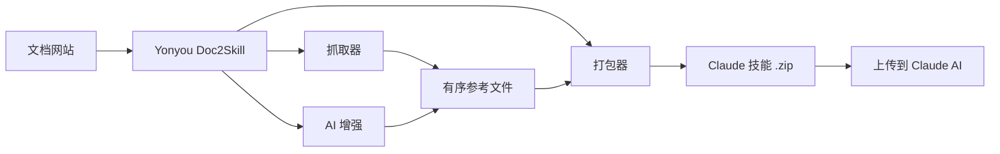

# Yonyou Doc2Skill

[English](README.md) | 简体中文

> ⚠️ **机器翻译声明**
>
> 本文档由 AI 自动翻译生成。虽然我们努力确保翻译质量，但可能存在不准确或不自然的表述。
>
> 如需修订翻译，请在你们自己的 Yonyou 仓库或项目跟踪系统中维护反馈入口。

[](docs/README.md)
[](https://opensource.org/licenses/MIT)
[](https://www.python.org/downloads/)
[](https://modelcontextprotocol.io)
[](tests/)

**🧠 AI 系统的数据层。** Yonyou Doc2Skill 将文档网站、GitHub 仓库、PDF、视频以及其他保留的来源类型转换为结构化知识资产——可在几分钟内为 AI 技能（Claude、Gemini、OpenAI）、RAG 流水线（LangChain、LlamaIndex、Pinecone）和 AI 编程助手（Cursor、Windsurf、Cline）提供支持。

> 🌐 **[浏览本地文档](docs/README.md)** - 直接从仓库内置文档开始使用 Yonyou Doc2Skill。

> 📋 **发布前请替换项目跟踪链接** - 对外发布时应改为 Yonyou 自己的项目看板或路线图。

## 🌐 生态系统

Yonyou Doc2Skill 是一个多仓库项目。以下是各部分所在位置：

| 仓库 | 描述 | 链接 |
|------|------|------|
| **yonyou-doc2skill** | 核心 CLI 和 MCP 服务器（本仓库） | `pip install yonyou-doc2skill` |
| **yonyou-doc2skill-docs** | 文档与上手材料 | [docs/README.md](docs/README.md) |
| **yonyou-doc2skill-configs** | 内部或精选预设/配置仓库 | 建议发布到 Yonyou 组织下 |
| **yonyou-doc2skill-plugin** | Claude Code / MCP 集成资产 | 建议发布到 Yonyou 组织下 |
| **yonyou-doc2skill-action** | 可选 CI/CD 自动化入口 | 建议发布到 Yonyou 组织下 |

> **想要贡献？** 网站和配置仓库是新贡献者的最佳起点！

## 🧠 AI 系统的数据层

**Yonyou Doc2Skill 是通用预处理层**，位于原始文档和所有使用它的 AI 系统之间。无论您是在构建 Claude 技能、LangChain RAG 流水线，还是 Cursor `.cursorrules` 文件——数据准备工作完全相同。只需执行一次，即可导出到所有目标平台。

```bash
# 一条命令 → 结构化知识资产
yonyou-doc2skill create https://docs.react.dev/
# 或: yonyou-doc2skill create facebook/react
# 或: yonyou-doc2skill create ./my-project

# 导出到任意 AI 系统
yonyou-doc2skill package output/react --target claude      # → Claude AI 技能 (ZIP)
yonyou-doc2skill package output/react --target langchain   # → LangChain Documents
yonyou-doc2skill package output/react --target llama-index # → LlamaIndex TextNodes
yonyou-doc2skill package output/react --target cursor      # → .cursorrules
```

### 可构建的输出

| 输出 | 目标 | 应用场景 |
|------|------|---------|
| **Claude 技能** (ZIP + YAML) | `--target claude` | Claude Code、Claude API |
| **Gemini 技能** (tar.gz) | `--target gemini` | Google Gemini |
| **OpenAI / Custom GPT** (ZIP) | `--target openai` | GPT-4o、自定义助手 |
| **LangChain Documents** | `--target langchain` | QA 链、智能体、检索器 |
| **LlamaIndex TextNodes** | `--target llama-index` | 查询引擎、对话引擎 |
| **Haystack Documents** | `--target haystack` | 企业级 RAG 流水线 |
| **Pinecone 就绪** (Markdown) | `--target markdown` | 向量上传 |
| **ChromaDB / FAISS / Qdrant** | `--format chroma/faiss/qdrant` | 本地向量数据库 |
| **Cursor** `.cursorrules` | `--target claude` → 复制 | Cursor IDE AI 上下文 |
| **Windsurf / Cline / Continue** | `--target claude` → 复制 | VS Code、IntelliJ、Vim |

### 为什么选择 Yonyou Doc2Skill

- ⚡ **快 99%** — 数天的手动数据准备 → 15–45 分钟
- 🎯 **AI 技能质量** — 500+ 行的 SKILL.md 文件，包含示例、模式和指南
- 📊 **RAG 就绪的分块** — 智能分块保留代码块并维护上下文
- 🔄 **保留的来源类型** — 将文档 + GitHub + PDF + 视频 + 本地文件 + Wiki 等合并为一个知识资产
- 🌐 **一次准备，导出所有目标** — 无需重新抓取即可导出到 16 个平台
- 🎬 **视频** — 从 YouTube 和本地视频提取代码、字幕和结构化知识
- ✅ **久经考验** — 2,540+ 测试，24+ 框架预设，生产就绪

## 快速开始

```bash
pip install yonyou-doc2skill

# 从任意来源构建 AI 技能
yonyou-doc2skill create https://docs.django.com/    # 文档网站
yonyou-doc2skill create django/django               # GitHub 仓库
yonyou-doc2skill create ./my-codebase               # 本地项目
yonyou-doc2skill create manual.pdf                  # PDF 文件
yonyou-doc2skill create manual.docx                 # Word 文档
yonyou-doc2skill create page.html                   # 本地 HTML
yonyou-doc2skill create guide.adoc                  # AsciiDoc 文档
yonyou-doc2skill create slides.pptx                 # PowerPoint 演示文稿

# 视频（YouTube、Vimeo 或本地文件 — 需要 yonyou-doc2skill[video]）
yonyou-doc2skill video --url https://www.youtube.com/watch?v=... --name mytutorial
# 首次使用？自动安装 GPU 感知的视觉依赖：
yonyou-doc2skill video --setup

# 根据用途导出
yonyou-doc2skill package output/django --target claude     # Claude AI 技能
yonyou-doc2skill package output/django --target langchain  # LangChain RAG
yonyou-doc2skill package output/django --target cursor     # Cursor IDE 上下文
```

**完整示例：**
- [Claude AI 技能](examples/claude-skill/) - 面向 Claude Code 的技能
- [LangChain RAG 流水线](examples/langchain-rag-pipeline/) - 基于 Chroma 的问答链
- [Cursor IDE 上下文](examples/cursor-react-skill/) - 框架感知 AI 编程

## 官方 Skill 交付方式

如果你希望最终用户通过一个 skill 来生成他们自己的 skill，建议一起交付两部分：

- 本地安装的 CLI：`yonyou-doc2skill`
- 官方 wrapper skill：`skills/yonyou-doc2skill/`

推荐模式是：

1. 用户先本地安装 `yonyou-doc2skill`
2. 用户把 `skills/yonyou-doc2skill/` 安装到自己的 agent skills 目录
3. 这个官方 skill 再调用本地 `yonyou-doc2skill create ...`
4. 如有需要，再继续调用 `yonyou-doc2skill package ...`

## 什么是 Yonyou Doc2Skill？

Yonyou Doc2Skill 是一个 **目标驱动的企业知识蒸馏引擎**。

它不是单纯把文档做成摘要，也不是只会把资料打包成一个通用 skill。它的核心能力是：把企业文档、代码仓库、Wiki、交付资料等来源，按不同目标场景蒸馏成可直接被 AI 使用的知识资产。

同一份来源，可以针对不同对象产出不同结果：

- 面向研发：编码规范 skill、reference skill、builder skill
- 面向交付：实施排障 skill、项目交付知识 skill
- 面向培训：tutorial skill、onboarding skill
- 面向知识问答：internal-wiki skill、RAG 就绪资产

一句话说，就是把企业知识从“文档存量”变成“可执行资产”。

当前支持把保留的来源类型——文档网站、GitHub 仓库、PDF、视频、Word 文档、本地代码库、本地 HTML 文件、AsciiDoc 文档、PowerPoint 演示文稿、Confluence 维基、用友 iKM 知识地图、Slack/Discord 聊天记录——转换为适用于不同 AI 目标的结构化知识资产：

| 使用场景 | 获得的内容 | 示例 |
|---------|-----------|------|
| **AI 技能** | 完整的 SKILL.md + 参考文件 | Claude Code、Gemini、GPT |
| **RAG 流水线** | 带丰富元数据的分块文档 | LangChain、LlamaIndex、Haystack |
| **向量数据库** | 预格式化的待上传数据 | Pinecone、Chroma、Weaviate、FAISS |
| **AI 编程助手** | IDE AI 自动读取的上下文文件 | Cursor、Windsurf、Cline、Continue.dev |

## 两种蒸馏模式

### 1. 自动提炼

- 用户只给来源时，系统先快速产出一个通用 skill 或知识包
- 适合零门槛试用、快速看产物、先做知识沉淀
- 解决“资料分散、难沉淀、上手慢”的第一步问题

### 2. 定向蒸馏

- 用户补一句目标，例如“给 Codex 做编码规范 skill”或“给交付同学做排障 skill”
- 系统再根据目标对象、使用场景、输出形态，自动映射到合适的 profile 和输出重点
- 这不是静态摘要，而是“同源多产物”的目标驱动蒸馏

Yonyou Doc2Skill 通过以下步骤，把原本数天的手动知识整理工作压缩成一条流水线：

1. **采集** — 文档、GitHub 仓库、本地代码库、PDF、视频、Wiki 等保留的来源类型
2. **分析** — 深度 AST 解析、模式检测、API 提取
3. **结构化** — 带元数据的分类参考文件
4. **增强** — AI 驱动的 SKILL.md 生成（Claude、Gemini 或本地）
5. **导出** — 从一个资产导出到 16 种平台专用格式

## 为什么使用 Yonyou Doc2Skill？

### 评委更容易感知到的价值

- 降低知识整理和 AI 接入门槛
- 提升研发与交付复用效率
- 减少 AI 使用中的上下文缺失和答非所问
- 让同一份企业知识按不同目标生成不同资产，而不是只产出一个静态摘要

### 面向 AI 技能构建者（Claude、Gemini、OpenAI）

- 🎯 **生产级技能** — 500+ 行的 SKILL.md 文件，包含代码示例、模式和指南
- 🔄 **增强工作流** — 应用 `security-focus`、`architecture-comprehensive` 或自定义 YAML 预设
- 🎮 **任意领域** — 游戏引擎（Godot、Unity）、框架（React、Django）、内部工具
- 🔧 **团队协作** — 将内部文档 + 代码整合为单一事实来源
- 📚 **高质量** — AI 增强，包含示例、快速参考和导航指南

### 面向 RAG 构建者和 AI 工程师

- 🤖 **RAG 就绪数据** — 预分块的 LangChain `Documents`、LlamaIndex `TextNodes`、Haystack `Documents`
- 🚀 **快 99%** — 数天的预处理 → 15–45 分钟
- 📊 **智能元数据** — 类别、来源、类型 → 更高的检索精度
- 🔄 **多源支持** — 在一个流水线中合并文档 + GitHub + PDF
- 🌐 **平台无关** — 无需重新抓取即可导出到任意向量数据库或框架

### 面向 AI 编程助手用户

- 💻 **Cursor / Windsurf / Cline** — 自动生成 `.cursorrules` / `.windsurfrules` / `.clinerules`
- 🎯 **持久上下文** — AI "了解"您的框架，无需重复提示
- 📚 **始终最新** — 文档更新时可在几分钟内更新上下文

## 典型业务场景

- 把《用友专业开发红皮书》蒸馏成给 Codex 使用的编码规范 skill
- 把研发规范站点蒸馏成给新人使用的 onboarding / tutorial skill
- 把项目实施手册蒸馏成交付同学使用的 troubleshooting skill
- 把公司制度、流程、FAQ 蒸馏成员工问答机器人使用的 internal-wiki skill
- 把框架/API 文档蒸馏成查询型 reference skill
- 把企业知识资料同步沉淀成 RAG 可直接消费的 chunk + metadata 资产

## 核心功能

### 🌐 文档抓取
- ✅ **llms.txt 支持** - 自动检测并使用 LLM 就绪文档文件（快 10 倍）
- ✅ **通用抓取器** - 适用于任意文档网站
- ✅ **智能分类** - 按主题自动组织内容
- ✅ **代码语言检测** - 识别 Python、JavaScript、C++、GDScript 等
- ✅ **24+ 即用预设** - Godot、React、Vue、Django、FastAPI 等

### 📄 PDF 支持
- ✅ **基础 PDF 提取** - 从 PDF 提取文本、代码和图片
- ✅ **扫描件 OCR** - 从扫描文档提取文本
- ✅ **密码保护 PDF** - 处理加密 PDF
- ✅ **表格提取** - 提取复杂表格
- ✅ **并行处理** - 大型 PDF 快 3 倍
- ✅ **智能缓存** - 重复运行快 50%

### 🎬 视频提取
- ✅ **YouTube 和本地视频** - 从视频提取字幕、代码和结构化知识
- ✅ **视觉帧分析** - 屏幕 OCR 提取代码编辑器、终端和幻灯片内容
- ✅ **GPU 自动检测** - 自动安装正确的 PyTorch 版本（CUDA/ROCm/MPS/CPU）
- ✅ **AI 增强** - 两阶段增强：清理 OCR + 生成精美 SKILL.md
- ✅ **时间裁剪** - 提取视频的特定片段（`--start-time`、`--end-time`）
- ✅ **播放列表支持** - 批量处理 YouTube 播放列表中的所有视频

### 🐙 GitHub 仓库分析
- ✅ **深度代码分析** - 支持 Python、JavaScript、TypeScript、Java、C++、Go 的 AST 解析
- ✅ **API 提取** - 函数、类、方法及参数和类型
- ✅ **仓库元数据** - README、文件树、语言统计、星标/分支数
- ✅ **GitHub Issues 和 PR** - 获取带标签和里程碑的开放/已关闭 issues
- ✅ **CHANGELOG 和发布** - 自动提取版本历史
- ✅ **冲突检测** - 对比文档化 API 与实际代码实现
- ✅ **MCP 集成** - 自然语言："抓取 GitHub 仓库 facebook/react"

### 🔄 统一多源抓取
- ✅ **合并多个来源** - 在一个技能中混合文档 + GitHub + PDF
- ✅ **冲突检测** - 自动发现文档与代码之间的差异
- ✅ **智能合并** - 基于规则或 AI 驱动的冲突解决
- ✅ **透明报告** - 带 ⚠️ 警告的并排对比
- ✅ **文档差距分析** - 识别过时文档和未文档化功能
- ✅ **单一事实来源** - 一个技能同时展示意图（文档）和现实（代码）
- ✅ **向后兼容** - 遗留单源配置继续有效

### 🤖 多 LLM 平台支持
- ✅ **12 个 LLM 平台** - Claude AI、Google Gemini、OpenAI ChatGPT、MiniMax AI、通用 Markdown、OpenCode、Kimi、DeepSeek、Qwen、OpenRouter、Together AI、Fireworks AI
- ✅ **通用抓取** - 相同文档适用于所有平台
- ✅ **平台专用打包** - 针对每个 LLM 的优化格式
- ✅ **一键导出** - `--target` 标志选择平台
- ✅ **可选依赖** - 仅安装所需内容
- ✅ **100% 向后兼容** - 现有 Claude 工作流无需更改

| 平台 | 格式 | 上传 | 增强 | API Key | 自定义端点 |
|------|------|------|------|---------|-----------|
| **Claude AI** | ZIP + YAML | ✅ 自动 | ✅ 是 | ANTHROPIC_API_KEY | ANTHROPIC_BASE_URL |
| **Google Gemini** | tar.gz | ✅ 自动 | ✅ 是 | GOOGLE_API_KEY | - |
| **OpenAI ChatGPT** | ZIP + Vector Store | ✅ 自动 | ✅ 是 | OPENAI_API_KEY | - |
| **通用 Markdown** | ZIP | ❌ 手动 | ❌ 否 | - | - |

```bash
# Claude（默认 - 无需更改！）
yonyou-doc2skill package output/react/
yonyou-doc2skill upload react.zip

# Google Gemini
pip install yonyou-doc2skill[gemini]
yonyou-doc2skill package output/react/ --target gemini
yonyou-doc2skill upload react-gemini.tar.gz --target gemini

# OpenAI ChatGPT
pip install yonyou-doc2skill[openai]
yonyou-doc2skill package output/react/ --target openai
yonyou-doc2skill upload react-openai.zip --target openai

# 通用 Markdown（通用导出）
yonyou-doc2skill package output/react/ --target markdown
```

<details>
<summary>🔧 <strong>Claude 兼容 API 的环境变量（如 GLM-4.7）</strong></summary>

Yonyou Doc2Skill 支持任意 Claude 兼容的 API 端点：

```bash
# 选项 1：官方 Anthropic API（默认）
export ANTHROPIC_API_KEY=sk-ant-...

# 选项 2：GLM-4.7 Claude 兼容 API
export ANTHROPIC_API_KEY=your-glm-47-api-key
export ANTHROPIC_BASE_URL=https://glm-4-7-endpoint.com/v1

# 所有 AI 增强功能将使用配置的端点
yonyou-doc2skill enhance output/react/
yonyou-doc2skill analyze --directory . --enhance
```

**注意**：设置 `ANTHROPIC_BASE_URL` 允许您使用任意 Claude 兼容的 API 端点，例如 GLM-4.7（智谱 AI）或其他兼容服务。

</details>

**安装：**
```bash
# 安装 Gemini 支持
pip install yonyou-doc2skill[gemini]

# 安装 OpenAI 支持
pip install yonyou-doc2skill[openai]

# 安装所有 LLM 平台
pip install yonyou-doc2skill[all-llms]
```

### 🔗 RAG 框架集成

- ✅ **LangChain Documents** - 直接导出为 `Document` 格式，包含 `page_content` + 元数据
  - 适用于：QA 链、检索器、向量存储、智能体
  - 示例：[LangChain RAG 流水线](examples/langchain-rag-pipeline/)
  - 指南：[LangChain 集成](docs/integrations/LANGCHAIN.md)

- ✅ **LlamaIndex TextNodes** - 导出为带唯一 ID + 嵌入的 `TextNode` 格式
  - 适用于：查询引擎、对话引擎、存储上下文
  - 示例：[LlamaIndex 查询引擎](examples/llama-index-query-engine/)
  - 指南：[LlamaIndex 集成](docs/integrations/LLAMA_INDEX.md)

- ✅ **Pinecone 就绪格式** - 针对向量数据库上传进行优化
  - 适用于：生产级向量搜索、语义搜索、混合搜索
  - 示例：[Pinecone 上传](examples/pinecone-upsert/)
  - 指南：[Pinecone 集成](docs/integrations/PINECONE.md)

**快速导出：**
```bash
# LangChain Documents（JSON）
yonyou-doc2skill package output/django --target langchain
# → output/django-langchain.json

# LlamaIndex TextNodes（JSON）
yonyou-doc2skill package output/django --target llama-index
# → output/django-llama-index.json

# Markdown（通用）
yonyou-doc2skill package output/django --target markdown
# → output/django-markdown/SKILL.md + references/
```

**完整 RAG 流水线指南：** [RAG 流水线文档](docs/integrations/RAG_PIPELINES.md)

---

### 🧠 AI 编程助手集成

将任意框架文档转换为 4+ 种 AI 助手的专家编程上下文：

- ✅ **Cursor IDE** - 为 AI 驱动的代码建议生成 `.cursorrules`
  - 适用于：框架专用代码生成、一致的编码模式
  - 指南：[Cursor 集成](docs/integrations/CURSOR.md)
  - 示例：[Cursor React 技能](examples/cursor-react-skill/)

- ✅ **Windsurf** - 使用 `.windsurfrules` 自定义 Windsurf AI 助手上下文
  - 适用于：IDE 原生 AI 辅助、流式编程
  - 指南：[Windsurf 集成](docs/integrations/WINDSURF.md)
  - 示例：[Windsurf FastAPI 上下文](examples/windsurf-fastapi-context/)

- ✅ **Cline（VS Code）** - VS Code 智能体的系统提示 + MCP
  - 适用于：VS Code 中的智能代码生成
  - 指南：[Cline 集成](docs/integrations/CLINE.md)
  - 示例：[Cline Django 助手](examples/cline-django-assistant/)

- ✅ **Continue.dev** - 与 IDE 无关的 AI 上下文服务器
  - 适用于：多 IDE 环境（VS Code、JetBrains、Vim），自定义 LLM 提供商
  - 指南：[Continue 集成](docs/integrations/CONTINUE_DEV.md)
  - 示例：[Continue 通用上下文](examples/continue-dev-universal/)

**快速导出（适用于 AI 编程工具）：**
```bash
# 适用于任意 AI 编程助手（Cursor、Windsurf、Cline、Continue.dev）
yonyou-doc2skill scrape --config configs/django.json
yonyou-doc2skill package output/django --target claude

# 复制到项目（以 Cursor 为例）
cp output/django-claude/SKILL.md my-project/.cursorrules

# 或用于 Windsurf
cp output/django-claude/SKILL.md my-project/.windsurf/rules/django.md

# 或用于 Cline
cp output/django-claude/SKILL.md my-project/.clinerules
```

**集成中心：** [所有 AI 系统集成](docs/integrations/INTEGRATIONS.md)

---

### 🌊 三流 GitHub 架构
- ✅ **三流分析** - 将 GitHub 仓库拆分为代码流、文档流和洞察流
- ✅ **统一代码库分析器** - 同时适用于 GitHub URL 和本地路径
- ✅ **C3.x 分析深度** - 选择"basic"（1–2 分钟）或"c3x"（20–60 分钟）分析
- ✅ **增强路由生成** - GitHub 元数据、README 快速入门、常见问题
- ✅ **Issue 集成** - 来自 GitHub Issues 的常见问题和解决方案
- ✅ **智能路由关键词** - GitHub 标签权重加倍，提升主题检测效果

**三流说明：**
- **流 1：代码** - 深度 C3.x 分析（模式、示例、指南、配置、架构）
- **流 2：文档** - 仓库文档（README、CONTRIBUTING、docs/*.md）
- **流 3：洞察** - 社区知识（Issues、标签、Stars、Forks）

```python
from yonyou_doc2skill.cli.unified_codebase_analyzer import UnifiedCodebaseAnalyzer

# 使用三流分析 GitHub 仓库
analyzer = UnifiedCodebaseAnalyzer()
result = analyzer.analyze(
    source="https://github.com/facebook/react",
    depth="c3x",  # 或 "basic" 快速分析
    fetch_github_metadata=True
)

print(f"设计模式: {len(result.code_analysis['c3_1_patterns'])}")
print(f"Stars: {result.github_insights['metadata']['stars']}")
```

**完整文档**：[三流实现总结](docs/IMPLEMENTATION_SUMMARY_THREE_STREAM.md)

### 🔐 智能速率限制管理与配置
- ✅ **多 Token 配置系统** - 管理多个 GitHub 账号（个人、工作、开源）
  - 安全配置存储在 `~/.config/yonyou-doc2skill/config.json`（权限 600）
  - 每个配置文件的速率限制策略：`prompt`、`wait`、`switch`、`fail`
  - 智能回退链：CLI 参数 → 环境变量 → 配置文件 → 提示
- ✅ **交互式配置向导** - 美观的终端 UI，轻松设置
- ✅ **智能速率限制处理器** - 不再无限等待！
  - 实时倒计时，自动切换配置文件
  - 四种策略：prompt（询问）、wait（倒计时）、switch（切换）、fail（中止）
- ✅ **断点续传** - 继续中断的任务
- ✅ **CI/CD 支持** - `--non-interactive` 标志用于自动化

**快速设置：**
```bash
# 一次性配置（5 分钟）
yonyou-doc2skill config --github

# 为私有仓库使用特定配置文件
yonyou-doc2skill github --repo mycompany/private-repo --profile work

# CI/CD 模式（快速失败，无提示）
yonyou-doc2skill github --repo owner/repo --non-interactive
```

### 🎯 Bootstrap 技能 - 自托管

将 yonyou-doc2skill 自身作为 Claude Code 技能生成：

```bash
./scripts/bootstrap_skill.sh
cp -r output/yonyou-doc2skill ~/.claude/skills/
```

### 🔐 私有配置仓库
- ✅ **基于 Git 的配置源** - 从私有/团队 Git 仓库获取配置
- ✅ **多源管理** - 注册无限数量的 GitHub、GitLab、Bitbucket 仓库
- ✅ **团队协作** - 在 3–5 人团队间共享自定义配置
- ✅ **企业支持** - 扩展到 500+ 开发者
- ✅ **安全认证** - 环境变量 token（GITHUB_TOKEN、GITLAB_TOKEN）

### 🤖 代码库分析（C3.x）

**C3.4：配置模式提取（含 AI 增强）**
- ✅ **9 种配置格式** - JSON、YAML、TOML、ENV、INI、Python、JavaScript、Dockerfile、Docker Compose
- ✅ **7 种模式类型** - 数据库、API、日志、缓存、邮件、认证、服务器配置
- ✅ **AI 增强** - 可选双模式 AI 分析（API + LOCAL）
- ✅ **安全分析** - 发现硬编码的密钥和暴露的凭证

**C3.3：AI 增强操作指南**
- ✅ **全面 AI 增强** - 将基础指南转换为专业教程
- ✅ **5 项自动改进** - 步骤说明、故障排除、前提条件、后续步骤、使用场景
- ✅ **双模式支持** - API 模式（Claude API）或 LOCAL 模式（Claude Code CLI）
- ✅ **LOCAL 模式零成本** - 使用您的 Claude Code Max 计划免费增强

**使用方法：**
```bash
# 快速分析（1–2 分钟，仅基础功能）
yonyou-doc2skill analyze --directory tests/ --quick

# 全面分析（含 AI，20–60 分钟）
yonyou-doc2skill analyze --directory tests/ --comprehensive

# 含 AI 增强
yonyou-doc2skill analyze --directory tests/ --enhance
```

**完整文档：** [docs/HOW_TO_GUIDES.md](docs/HOW_TO_GUIDES.md#ai-enhancement-new)

### 🔄 增强工作流预设

可重用的 YAML 定义增强流水线，控制 AI 如何将原始文档转换为精心打磨的技能。

- ✅ **5 个内置预设** — `default`、`minimal`、`security-focus`、`architecture-comprehensive`、`api-documentation`
- ✅ **用户自定义预设** — 将自定义工作流添加到 `~/.config/yonyou-doc2skill/workflows/`
- ✅ **多工作流链式** — 在一条命令中链式使用两个或更多工作流
- ✅ **完整 CLI 管理** — 列出、查看、复制、添加、删除和验证工作流

```bash
# 应用单个工作流
yonyou-doc2skill create ./my-project --enhance-workflow security-focus

# 链式多个工作流（按顺序应用）
yonyou-doc2skill create ./my-project \
  --enhance-workflow security-focus \
  --enhance-workflow minimal

# 管理预设
yonyou-doc2skill workflows list                          # 列出所有（内置 + 用户）
yonyou-doc2skill workflows show security-focus           # 显示 YAML 内容
yonyou-doc2skill workflows copy security-focus           # 复制到用户目录以便编辑
yonyou-doc2skill workflows add ./my-workflow.yaml        # 安装自定义预设
yonyou-doc2skill workflows remove my-workflow            # 删除用户预设
yonyou-doc2skill workflows validate security-focus       # 验证预设结构

# 同时复制多个
yonyou-doc2skill workflows copy security-focus minimal api-documentation

# 同时添加多个文件
yonyou-doc2skill workflows add ./wf-a.yaml ./wf-b.yaml

# 同时删除多个
yonyou-doc2skill workflows remove my-wf-a my-wf-b
```

**YAML 预设格式：**
```yaml
name: security-focus
description: "安全重点审查：漏洞、认证、数据处理"
version: "1.0"
stages:
  - name: vulnerabilities
    type: custom
    prompt: "审查 OWASP Top 10 和常见安全漏洞..."
  - name: auth-review
    type: custom
    prompt: "检查认证和授权模式..."
    uses_history: true
```

### ⚡ 性能与规模
- ✅ **异步模式** - 使用 async/await 抓取速度快 2–3 倍（使用 `--async` 标志）
- ✅ **大型文档支持** - 通过智能拆分处理 10K–40K+ 页文档
- ✅ **路由器/Hub 技能** - 智能路由到专用子技能
- ✅ **并行抓取** - 同时处理多个技能
- ✅ **检查点/续传** - 长时间抓取永不丢失进度
- ✅ **缓存系统** - 抓取一次，即时重建

### ✅ 质量保证
- ✅ **全面测试** - 2,540+ 测试，全面覆盖

---

## 📦 安装

```bash
# 基础安装（文档抓取、GitHub 分析、PDF、打包）
pip install yonyou-doc2skill

# 包含所有 LLM 平台支持
pip install yonyou-doc2skill[all-llms]

# 包含 MCP 服务器
pip install yonyou-doc2skill[mcp]

# 全部功能
pip install yonyou-doc2skill[all]
```

**需要帮助选择？** 运行设置向导：
```bash
yonyou-doc2skill-setup
```

### 安装选项

| 安装命令 | 功能 |
|---------|------|
| `pip install yonyou-doc2skill` | 抓取、GitHub 分析、PDF、所有平台 |
| `pip install yonyou-doc2skill[gemini]` | + Google Gemini 支持 |
| `pip install yonyou-doc2skill[openai]` | + OpenAI ChatGPT 支持 |
| `pip install yonyou-doc2skill[all-llms]` | + 所有 LLM 平台 |
| `pip install yonyou-doc2skill[mcp]` | + MCP 服务器 |
| `pip install yonyou-doc2skill[video]` | + YouTube/Vimeo 字幕和元数据提取 |
| `pip install yonyou-doc2skill[video-full]` | + Whisper 转录和视觉帧提取 |
| `pip install yonyou-doc2skill[ocr]` | + OCR 支持（PDF 扫描件、视觉帧） |
| `pip install yonyou-doc2skill[confluence]` | + Confluence 维基支持 |
| `pip install yonyou-doc2skill[all]` | 全部功能 |

> **视频视觉依赖（GPU 感知）：** 安装 `yonyou-doc2skill[video-full]` 后，运行
> `yonyou-doc2skill video --setup` 自动检测您的 GPU 并安装正确的 PyTorch
> 版本 + easyocr。这是安装视觉提取依赖的推荐方式。

---

## 🚀 一键安装工作流

**从配置到上传技能的最快方式——全自动化：**

```bash
# 从官方配置安装 React 技能（自动上传到 Claude）
yonyou-doc2skill install --config react

# 从本地配置文件安装
yonyou-doc2skill install --config configs/custom.json

# 安装但不上传（仅打包）
yonyou-doc2skill install --config django --no-upload

# 预览工作流而不执行
yonyou-doc2skill install --config react --dry-run
```

**执行阶段：**
```
📥 阶段 1：获取配置（如果提供配置名称）
📖 阶段 2：抓取文档
✨ 阶段 3：AI 增强
📦 阶段 4：打包技能
☁️  阶段 5：上传到 Claude（可选，需要 API Key）
```

---

## 📊 功能矩阵

Yonyou Doc2Skill 支持 **12 个 LLM 平台**、**11 种保留来源类型**和 **5 种技能模式**，功能完全对等。

**平台：** Claude AI、Google Gemini、OpenAI ChatGPT、MiniMax AI、通用 Markdown、OpenCode、Kimi、DeepSeek、Qwen、OpenRouter、Together AI、Fireworks AI
**来源类型：** 文档网站、GitHub 仓库、PDF、Word、视频、本地代码库、本地 HTML、AsciiDoc 文档、PowerPoint 演示文稿、Confluence 维基、用友 iKM 知识地图、Slack/Discord 聊天记录
**技能模式：** 文档、GitHub、PDF、统一多源、本地仓库

完整信息请查看 [完整功能矩阵](docs/FEATURE_MATRIX.md)。

### 快速平台对比

| 功能 | Claude | Gemini | OpenAI | Markdown |
|------|--------|--------|--------|----------|
| 格式 | ZIP + YAML | tar.gz | ZIP + Vector | ZIP |
| 上传 | ✅ API | ✅ API | ✅ API | ❌ 手动 |
| 增强 | ✅ Sonnet 4 | ✅ 2.0 Flash | ✅ GPT-4o | ❌ 无 |
| 所有技能模式 | ✅ | ✅ | ✅ | ✅ |

---

## 使用示例

### 文档抓取

```bash
# 抓取文档网站
yonyou-doc2skill scrape --config configs/react.json

# 快速抓取（无需配置）
yonyou-doc2skill scrape --url https://react.dev --name react

# 异步模式（快 3 倍）
yonyou-doc2skill scrape --config configs/godot.json --async --workers 8
```

### PDF 提取

```bash
# 基础 PDF 提取
yonyou-doc2skill pdf --pdf docs/manual.pdf --name myskill

# 高级功能
yonyou-doc2skill pdf --pdf docs/manual.pdf --name myskill \
    --extract-tables \        # 提取表格
    --parallel \              # 快速并行处理
    --workers 8               # 使用 8 个 CPU 核心

# 扫描 PDF（需要: pip install pytesseract Pillow）
yonyou-doc2skill pdf --pdf docs/scanned.pdf --name myskill --ocr
```

### 视频提取

```bash
# 安装视频支持
pip install yonyou-doc2skill[video]        # 字幕 + 元数据
pip install yonyou-doc2skill[video-full]   # + Whisper 转录 + 视觉帧提取

# 自动检测 GPU 并安装视觉依赖（PyTorch + easyocr）
yonyou-doc2skill video --setup

# 从 YouTube 视频提取
yonyou-doc2skill video --url https://www.youtube.com/watch?v=dQw4w9WgXcQ --name mytutorial

# 从 YouTube 播放列表提取
yonyou-doc2skill video --playlist https://www.youtube.com/playlist?list=... --name myplaylist

# 从本地视频文件提取
yonyou-doc2skill video --video-file recording.mp4 --name myrecording

# 使用视觉帧分析提取（需要 video-full 依赖）
yonyou-doc2skill video --url https://www.youtube.com/watch?v=... --name mytutorial --visual

# 使用 AI 增强（清理 OCR + 生成精美 SKILL.md）
yonyou-doc2skill video --url https://www.youtube.com/watch?v=... --visual --enhance-level 2

# 裁剪视频的特定片段（支持秒数、MM:SS、HH:MM:SS 格式）
yonyou-doc2skill video --url https://www.youtube.com/watch?v=... --start-time 1:30 --end-time 5:00

# 使用 Vision API 处理低置信度 OCR 帧（需要 ANTHROPIC_API_KEY）
yonyou-doc2skill video --url https://www.youtube.com/watch?v=... --visual --vision-ocr

# 从之前提取的数据重建技能（跳过下载）
yonyou-doc2skill video --from-json output/mytutorial/video_data/extracted_data.json --name mytutorial
```

> **完整指南：** 参见 [docs/VIDEO_GUIDE.md](docs/VIDEO_GUIDE.md) 了解完整 CLI 参考、
> 视觉流水线详情、AI 增强选项和故障排除。

### GitHub 仓库分析

```bash
# 基础仓库抓取
yonyou-doc2skill github --repo facebook/react

# 配置认证（更高速率限制）
export GITHUB_TOKEN=ghp_your_token_here
yonyou-doc2skill github --repo facebook/react

# 自定义包含内容
yonyou-doc2skill github --repo django/django \
    --include-issues \        # 提取 GitHub Issues
    --max-issues 100 \        # 限制 issue 数量
    --include-changelog       # 提取 CHANGELOG.md
```

### 统一多源抓取

**将文档 + GitHub + PDF 合并为一个带冲突检测的统一技能：**

```bash
# 使用现有统一配置
yonyou-doc2skill unified --config configs/react_unified.json

# 或创建统一配置
cat > configs/myframework_unified.json << 'EOF'
{
  "name": "myframework",
  "merge_mode": "rule-based",
  "sources": [
    {
      "type": "documentation",
      "base_url": "https://docs.myframework.com/",
      "max_pages": 200
    },
    {
      "type": "github",
      "repo": "owner/myframework",
      "code_analysis_depth": "surface"
    }
  ]
}
EOF

yonyou-doc2skill unified --config configs/myframework_unified.json
```

**冲突检测自动发现：**
- 🔴 **代码中缺失**（高）：已文档化但未实现
- 🟡 **文档中缺失**（中）：已实现但未文档化
- ⚠️ **签名不匹配**：参数/类型不同
- ℹ️ **描述不匹配**：解释不同

**完整指南：** 参见 [docs/UNIFIED_SCRAPING.md](docs/UNIFIED_SCRAPING.md)。

### 私有配置仓库

**使用私有 Git 仓库在团队间共享自定义配置：**

```bash
# 使用 MCP 工具注册团队私有仓库
add_config_source(
    name="team",
    git_url="https://github.com/mycompany/skill-configs.git",
    token_env="GITHUB_TOKEN"
)

# 从团队仓库获取配置
fetch_config(source="team", config_name="internal-api")
```

**支持的平台：**
- GitHub（`GITHUB_TOKEN`）、GitLab（`GITLAB_TOKEN`）、Gitea（`GITEA_TOKEN`）、Bitbucket（`BITBUCKET_TOKEN`）

**完整指南：** 参见 [docs/GIT_CONFIG_SOURCES.md](docs/GIT_CONFIG_SOURCES.md)。

## 工作原理



0. **检测 llms.txt** - 优先检查 llms-full.txt、llms.txt、llms-small.txt
1. **抓取**：提取文档中的所有页面
2. **分类**：将内容组织为主题（API、指南、教程等）
3. **增强**：AI 分析文档并创建包含示例的完整 SKILL.md
4. **打包**：将所有内容打包为 Claude 就绪的 `.zip` 文件

## 📋 前提条件

**开始前，请确保您具备：**

1. **Python 3.10 或更高版本** - [下载](https://www.python.org/downloads/) | 检查：`python3 --version`
2. **Git** - [下载](https://git-scm.com/) | 检查：`git --version`
3. **15–30 分钟**用于首次设置

**首次使用？** → **[从这里开始：防弹快速入门指南](BULLETPROOF_QUICKSTART.md)** 🎯

---

## 📤 上传技能到 Claude

技能打包完成后，需要将其上传到 Claude：

### 选项 1：自动上传（基于 API）

```bash
# 设置 API Key（一次性）
export ANTHROPIC_API_KEY=sk-ant-...

# 打包并自动上传
yonyou-doc2skill package output/react/ --upload

# 或上传已有的 .zip
yonyou-doc2skill upload output/react.zip
```

### 选项 2：手动上传（无需 API Key）

```bash
# 打包技能
yonyou-doc2skill package output/react/
# → 创建 output/react.zip

# 然后手动上传：
# - 访问 https://claude.ai/skills
# - 点击"上传技能"
# - 选择 output/react.zip
```

### 选项 3：MCP（Claude Code）

```
在 Claude Code 中，直接询问：
"打包并上传 React 技能"
```

---

## 🤖 安装到 AI 代理

Yonyou Doc2Skill 可自动将技能安装到 18 个 AI 编程代理。

```bash
# 安装到特定代理
yonyou-doc2skill install-agent output/react/ --agent cursor

# 一次性安装到所有代理
yonyou-doc2skill install-agent output/react/ --agent all

# 预览而不安装
yonyou-doc2skill install-agent output/react/ --agent cursor --dry-run
```

### 支持的代理

| 代理 | 路径 | 类型 |
|------|------|------|
| **Claude Code** | `~/.claude/skills/` | 全局 |
| **Cursor** | `.cursor/skills/` | 项目 |
| **VS Code / Copilot** | `.github/skills/` | 项目 |
| **Amp** | `~/.amp/skills/` | 全局 |
| **Goose** | `~/.config/goose/skills/` | 全局 |
| **OpenCode** | `~/.opencode/skills/` | 全局 |
| **Windsurf** | `~/.windsurf/skills/` | 全局 |
| **Roo Code** | `.roo/skills/` | 项目 |
| **Cline** | `.cline/skills/` | 项目 |
| **Aider** | `~/.aider/skills/` | 全局 |
| **Bolt** | `.bolt/skills/` | 项目 |
| **Kilo Code** | `.kilo/skills/` | 项目 |
| **Continue** | `~/.continue/skills/` | 全局 |
| **Kimi Code** | `~/.kimi/skills/` | 全局 |

---

## 🔌 MCP 集成（27 个工具）

Yonyou Doc2Skill 提供 MCP 服务器，可在 Claude Code、Cursor、Windsurf、VS Code + Cline 或 IntelliJ IDEA 中使用。

```bash
# stdio 模式（Claude Code、VS Code + Cline）
python -m yonyou_doc2skill.mcp.server_fastmcp

# HTTP 模式（Cursor、Windsurf、IntelliJ）
python -m yonyou_doc2skill.mcp.server_fastmcp --transport http --port 8765

# 一次性自动配置所有代理
./setup_mcp.sh
```

**所有 27 个工具：**
- **核心（9 个）：** `list_configs`、`generate_config`、`validate_config`、`estimate_pages`、`scrape_docs`、`package_skill`、`upload_skill`、`enhance_skill`、`install_skill`
- **扩展（11 个）：** `scrape_github`、`scrape_pdf`、`scrape_generic`、`unified_scrape`、`merge_sources`、`detect_conflicts`、`add_config_source`、`fetch_config`、`list_config_sources`、`remove_config_source`、`split_config`
- **向量数据库（4 个）：** `export_to_chroma`、`export_to_weaviate`、`export_to_faiss`、`export_to_qdrant`
- **云存储（3 个）：** `cloud_upload`、`cloud_download`、`cloud_list`

> `scrape_generic` 现面向保留的通用来源类型：本地 HTML、AsciiDoc 文档、PowerPoint 演示文稿、Confluence 维基、Slack/Discord 聊天记录。

**完整指南：** [docs/MCP_SETUP.md](docs/MCP_SETUP.md)

---

## ⚙️ 配置

### 可用预设（24+）

```bash
# 列出所有预设
yonyou-doc2skill list-configs
```

| 类别 | 预设 |
|------|------|
| **Web 框架** | `react`、`vue`、`angular`、`svelte`、`nextjs` |
| **Python** | `django`、`flask`、`fastapi`、`sqlalchemy`、`pytest` |
| **游戏开发** | `godot`、`pygame`、`unity` |
| **工具与 DevOps** | `docker`、`kubernetes`、`terraform`、`ansible` |
| **统一（文档 + GitHub）** | `react-unified`、`vue-unified`、`nextjs-unified` 等 |

### 创建您自己的配置

```bash
# 选项 1：交互式
yonyou-doc2skill scrape --interactive

# 选项 2：复制并编辑预设
cp configs/react.json configs/myframework.json
nano configs/myframework.json
yonyou-doc2skill scrape --config configs/myframework.json
```

### 配置文件结构

```json
{
  "name": "myframework",
  "description": "何时使用此技能",
  "base_url": "https://docs.myframework.com/",
  "selectors": {
    "main_content": "article",
    "title": "h1",
    "code_blocks": "pre code"
  },
  "url_patterns": {
    "include": ["/docs", "/guide"],
    "exclude": ["/blog", "/about"]
  },
  "categories": {
    "getting_started": ["intro", "quickstart"],
    "api": ["api", "reference"]
  },
  "rate_limit": 0.5,
  "max_pages": 500
}
```

### 配置存储位置

工具按以下顺序搜索：
1. 提供的确切路径
2. `./configs/`（当前目录）
3. `~/.config/yonyou-doc2skill/configs/`（用户配置目录）
4. docs.yonyou.example API（预设配置）

---

## 📊 创建的内容

```
output/
├── godot_data/              # 抓取的原始数据
│   ├── pages/              # JSON 文件（每页一个）
│   └── summary.json        # 概览
│
└── godot/                   # 技能文件
    ├── SKILL.md            # 含真实示例的增强版
    ├── references/         # 分类文档
    │   ├── index.md
    │   ├── getting_started.md
    │   ├── scripting.md
    │   └── ...
    ├── scripts/            # 空（可添加自己的脚本）
    └── assets/             # 空（可添加自己的资源）
```

---

## 🐛 故障排除

### 未提取到内容？
- 检查您的 `main_content` 选择器
- 尝试：`article`、`main`、`div[role="main"]`

### 数据存在但不使用？
```bash
# 强制重新抓取
rm -rf output/myframework_data/
yonyou-doc2skill scrape --config configs/myframework.json
```

### 分类不理想？
编辑配置中的 `categories` 部分，使用更好的关键词。

### 想要更新文档？
```bash
# 删除旧数据并重新抓取
rm -rf output/godot_data/
yonyou-doc2skill scrape --config configs/godot.json
```

### 增强不工作？
```bash
# 检查 API Key 是否设置
echo $ANTHROPIC_API_KEY

# 尝试 LOCAL 模式（使用 Claude Code Max，无需 API Key）
yonyou-doc2skill enhance output/react/ --mode LOCAL

# 监控后台增强状态
yonyou-doc2skill enhance-status output/react/ --watch
```

### GitHub 速率限制问题？
```bash
# 设置 GitHub Token（5000 次/小时 vs 匿名 60 次/小时）
export GITHUB_TOKEN=ghp_your_token_here

# 或配置多个配置文件
yonyou-doc2skill config --github
```

---

## 📈 性能

| 任务 | 时间 | 备注 |
|------|------|------|
| 抓取（同步）| 15–45 分钟 | 仅首次，基于线程 |
| 抓取（异步）| 5–15 分钟 | `--async` 标志快 2–3 倍 |
| 构建 | 1–3 分钟 | 从缓存快速重建 |
| 重建 | <1 分钟 | 使用 `--skip-scrape` |
| 增强（LOCAL）| 30–60 秒 | 使用 Claude Code Max |
| 增强（API）| 20–40 秒 | 需要 API Key |
| 打包 | 5–10 秒 | 最终 .zip 创建 |

---

## 📚 文档

### 入门指南
- **[BULLETPROOF_QUICKSTART.md](BULLETPROOF_QUICKSTART.md)** - 🎯 **新用户从这里开始！**
- **[QUICKSTART.md](QUICKSTART.md)** - 有经验用户的快速入门
- **[TROUBLESHOOTING.md](TROUBLESHOOTING.md)** - 常见问题和解决方案
- **[docs/QUICK_REFERENCE.md](docs/QUICK_REFERENCE.md)** - 单页速查表

### 指南
- **[docs/LARGE_DOCUMENTATION.md](docs/LARGE_DOCUMENTATION.md)** - 处理 10K–40K+ 页文档
- **[ASYNC_SUPPORT.md](ASYNC_SUPPORT.md)** - 异步模式指南（快 2–3 倍）
- **[docs/ENHANCEMENT_MODES.md](docs/ENHANCEMENT_MODES.md)** - AI 增强模式指南
- **[docs/MCP_SETUP.md](docs/MCP_SETUP.md)** - MCP 集成设置
- **[docs/UNIFIED_SCRAPING.md](docs/UNIFIED_SCRAPING.md)** - 多源抓取
- **[docs/VIDEO_GUIDE.md](docs/VIDEO_GUIDE.md)** - 视频提取完整指南

### 集成指南
- **[docs/integrations/LANGCHAIN.md](docs/integrations/LANGCHAIN.md)** - LangChain RAG
- **[docs/integrations/CURSOR.md](docs/integrations/CURSOR.md)** - Cursor IDE
- **[docs/integrations/WINDSURF.md](docs/integrations/WINDSURF.md)** - Windsurf IDE
- **[docs/integrations/CLINE.md](docs/integrations/CLINE.md)** - Cline（VS Code）
- **[docs/integrations/RAG_PIPELINES.md](docs/integrations/RAG_PIPELINES.md)** - 所有 RAG 流水线

---

## 📝 许可证

MIT 许可证 - 详见 [LICENSE](LICENSE) 文件

---

祝您构建技能愉快！ 🚀
